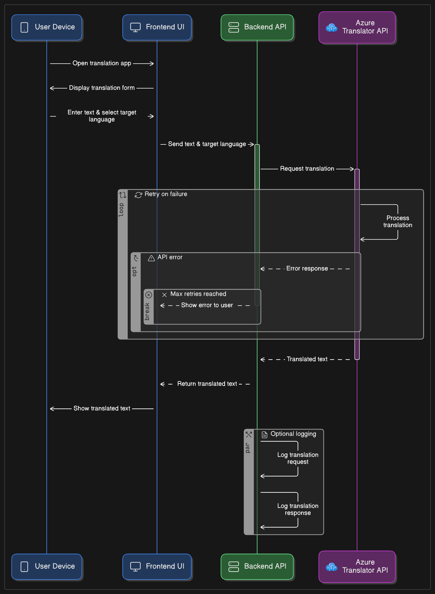

# Azure-Translator

Azure Translator is a web-based translation application built using Azure Cognitive Services. It enables users to translate text between more than 100 languages in real-time. The project demonstrates the integration of Azure Translator REST API with a user-friendly front end.

## Live Demo

Try the application online at:  
[https://azure-translator.onrender.com/](https://azure-translator.onrender.com/)

## Features

- Real-time text translation
- Supports 100+ languages
- Clean and simple user interface
- Powered by Azure Cognitive Services Translator API

## Technologies Used

- Azure Cognitive Services - Translator API
- HTML, CSS, JavaScript

## How to Use

1. Enter the text you want to translate.
2. Select the target language.
3. Click the translate button to get the translation.

## License

This project is licensed under the MIT License.
